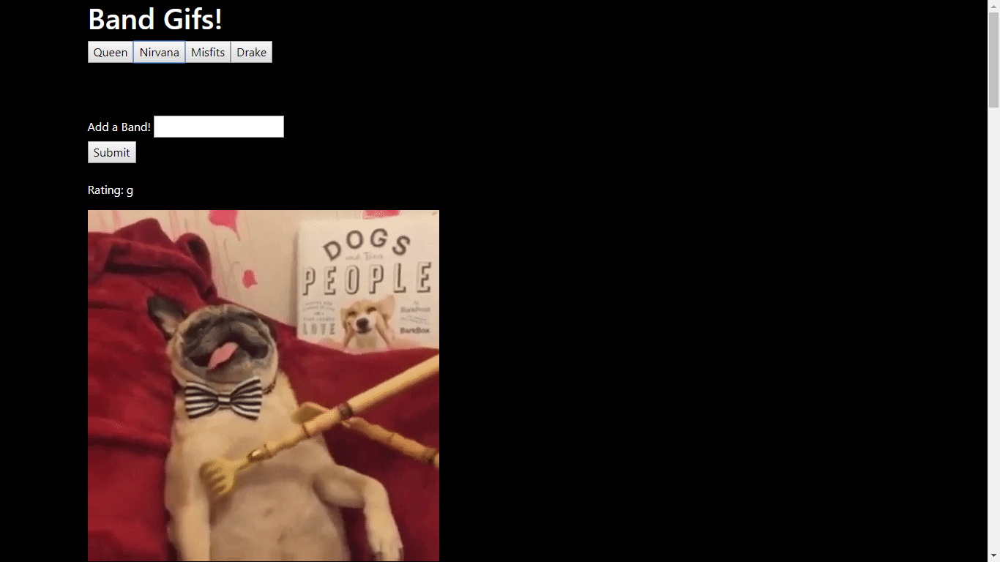
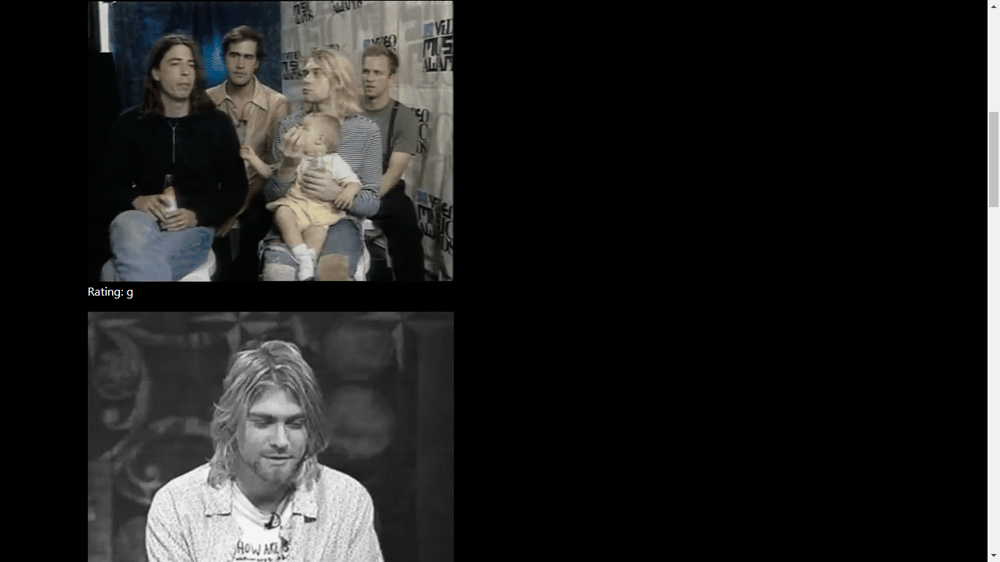
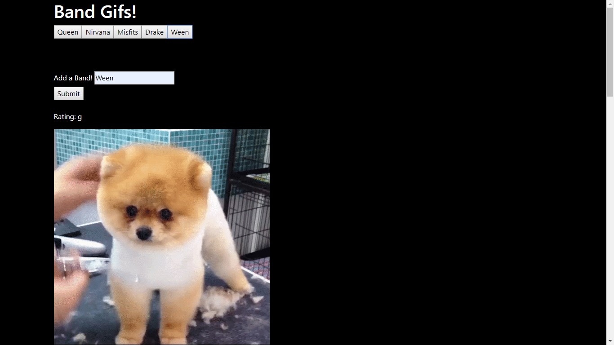

# Link
https://chris284891.github.io/GifTastic/

# Giftastic
With this app I expiremented with the Giphy API.

# Problem
Create an app that displays GIFs on command.

# Solution
Created divs with an id then called said id with jQuery and rendered buttons based on what items were in the array with a for loop. Then when said button is clicked, it is called in the function with the API call which searches Giphy for all GIFs that have a tag that is the same as the text in the button.

# Bug fix(s)
- Gifs weren't playing when clicked. Fixed it by changing the class in the selector to just "document" and then taking the class and turning it into one of the parameters.
- Gifs weren't rendering when a new button was created. Fixed this by duplicating entire onclick listener for ajax call and inserting it into the function for creating new button.

# Tech
- Giphy API
- jQuery
- HTML 5
- CSS 3

# Instructions
Click the buttons to load the top 10 gifs related to whichever button you clicked. Also add as many band buttons as you want to search their corresponding gifs. Click on gifs to make them play.

# How to Edit
- Click on green button that says "Clone or download"
- Download zip then extract all
- Then open in text editor of your choice
- If you want to run app locally just open index.html

# Prequisites
Just make sure you have a current updated browser.
